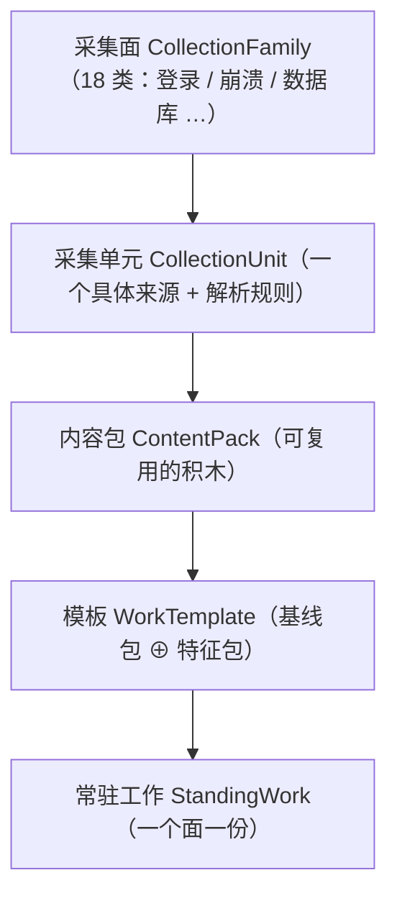
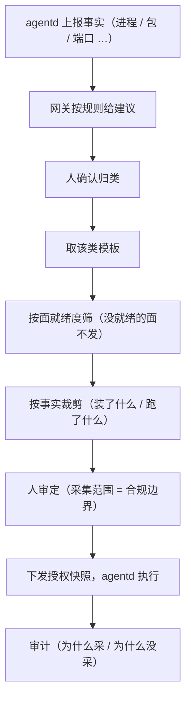

# Agent 采集内容与工作：设计说明

> 这份文档面向**第一次接触**这套设计的人（运维、前端、新同事），用尽量少的术语讲清一件事：
> **网关怎么决定"一台机器该采什么"，又怎么把它变成 agentd 真正执行的活。**
> 精确的字段与规则在模型和另几篇设计文档里，本文只讲"想通了什么"。

## 1. 一页看懂

**内容侧**（能采什么 → 这类机器该采什么）：

**流程侧**（从事实到真正干活）：

一句话串起来：

> **事实 → 建议 → 判定 → 模板 → 按面展开 → 按事实裁剪 → 审定 → 工作 → 执行 → 审计。**

## 2. 五个名词（用吃饭打比方）

| 名词 | 打比方 | 准确含义 |
|---|---|---|
| **采集面**（`CollectionFamily`） | 菜单上的**分类**：凉菜 / 热菜 / 主食 | 内容的类别，平台无关（登录、提权、崩溃、数据库…共 18 类） |
| **采集单元**（`CollectionUnit`） | 一道**具体的菜** | 某个面上的一条具体内容：从哪读（来源）+ 怎么解析（规则）。**必须"采得到 = 解析得了"**，否则不算一道菜 |
| **内容包**（`ContentPack`） | 一个**拼盘** | 常一起出现的一组单元，可复用。每平台有恰好一个"基线包" |
| **模板**（`WorkTemplate`） | 这类机器的**推荐套餐** | = 平台基线包 ⊕ 若干特征包。例：开发机 = 日常基线 + 开发包 |
| **工作**（`StandingWork`） | 真正端上桌的**一份活** | 粒度 = **一个面一份**。例：这台机器分到"登录"和"崩溃"两份活 |

## 3. 跟一台 Mac 开发机走一遍

1. **上报事实**：agentd 采集到本机进程里有 `xcodebuild`、`/opt/homebrew/...`、`mise` → 压缩成事实摘要上报。
2. **给建议**：网关按规则表打分 → 建议 `MacDev`，置信度 90，并可列出依据（命中了哪几条规则）。
3. **人确认**：管理员在页面采纳"MacDev"（也可以改判）。
4. **取模板**：`MacDev` → `macos-dev` 模板（= `macos-base` 包 + `macos-dev` 包，覆盖约 12 个面）。
5. **按面就绪度筛**：哪些面的**解析规则已经就绪**？就绪的面才发。
6. **按事实裁剪**：模板里"开发工具链"这个单元写着"装了 homebrew 或 xcode 才采"——这台机器装了，采；另一台上没装，跳过并记录原因。
7. **人审定**：采集范围就是合规边界，必须由人过一遍。
8. **下发**：变成若干份常驻工作（一面一份），agentd 拉取执行。
9. **审计**：任何时候都能回答"为什么这台机器采了 X""为什么没采 Y"。

## 4. 八个关键决策

| # | 决策 | 为什么 | 现在 |
|---|---|---|---|
| 1 | **组合，不是继承** | 机器类别之间是**交叉**关系（计算服务器与数据服务器各有专有面，谁也不含谁）；内容要的是“叠加”，不是“父子” | 模板 = **平台基线包 ⊕ 特征包**。类别只是“预设选哪几块”，不是继承的根 |
| 2 | **工作粒度 = 面** | 每个面要能**独立**暂停 / 限流 / 审计 | 一个面 = 一份工作；模板按 `family_scope` 展开成“一面一份” |
| 3 | **就绪度分两层** | “规则好了没”与“策展成熟没”是两件事；混在一起会让**已经就绪的部分也被封死** | **规则就绪度**在单元、**策展成熟度**在包/模板；闸门是**面就绪度**，没就绪的面单独跳过，规则好了自动启用 |
| 4 | **目录版本是一条引用** | 换版要能**逐个迁移**，且**不能悄悄改掉**已授权的工作 | 多版**并存**（`superseded_by`）；模板可滞后；已授权工作**锁版**（`StandingWork.catalog_version`） |
| 5 | **“不知道” ≠ “没有”** | 探针没采到时，“装了 postgres 吗”的答案**不是“没装”** | 求值**三态**：命中 / 不命中 / **无法判定**；“无法判定”单独记，不冒充“没装” |
| 6 | **来源是结构，不是字符串** | 要能**校验**来源，并把“一个串里的多个来源”**拆开** | 结构化 `{类型, 取值}`，**一个来源一条**；四种类型（文件 / 导出器 / 统一日志 / 指标间隔） |
| 7 | **覆盖度要能数出来** | “覆盖多少”必须是一个**可度量的数**，挑下一个类别才有依据 | **机队覆盖度**：各类别台数 + **未归类台数** |
| 8 | **用途：规则在网关，模型在中心** | 网关要**离线自足、确定性、可解释**；算力与模型更新集中在中心 | 网关只做规则推断；AI/模型只在中心、**只产建议、人工审定**；**网关不引入 AI 依赖** |

## 5. 为什么不让 AI 直接决定采什么

看着更省事，其实只省了一半：

- **省掉的**：类别、模板、裁剪这一整套人工策展（第 1–2 节的积木/套餐）。
- **省不掉的**：
  - **"采得到 = 解析得了"**——内容必须能落到数据面的解析规则上，所以 AI 也只能**从现成目录里挑**，不能自由生成；
  - **审计**——现在"为什么采/没采"是机器可查的，AI 给的理由只是"说辞"；
  - **确定性**——同一份事实重算要给同一个结果（否则机器采集范围会抖）。
- 所以结论是：**AI 往后放，且只在中心**。网关这条链路必须**离线自足、确定性、可解释**。

## 6. 名词速查

| 名词 | 英文 | 一句话 |
|---|---|---|
| 采集面 | `CollectionFamily` | 内容的类别（登录/崩溃/数据库…），18 个 |
| 采集单元 | `CollectionUnit` | 一条具体内容：来源 + 解析规则 |
| 内容包 | `ContentPack` | 可复用的单元组合（基线包 / 特征包） |
| 常驻工作模板 | `WorkTemplate` | 这类机器的推荐套餐 = 基线包 ⊕ 特征包 |
| 机器类别 | `MachineClass` | 预设键（MacDaily / MacDev / LinuxCompute / LinuxData） |
| 常驻工作 | `StandingWork` | 派给某台机器的一份活，粒度 = 一个面 |
| 工作授权快照 | `WorkGrant` | 这台机器当前该干哪些活（幂等，可重复拉） |
| 用途建议 / 判定 | `PurposeSuggestion` / `AgentClassification` | 机器给的（可解释）/ 人定的（留痕） |
| 选中依据 | `SelectionBasis` | 为什么选了这些单元、哪些没选及原因 |
| 机队覆盖度 | `FleetPurposeCoverage` | 各类别台数 + 未归类台数 |

## 7. 相关文档

- [`agent-work-templates.md`](./agent-work-templates.md)：模板体系细节与全部字段。
- [`agent-purpose-inference.md`](./agent-purpose-inference.md)：用途怎么推断（规则表、置信度）。
- [`agent-work-delivery-plan.md`](./agent-work-delivery-plan.md)：交付批次与当前进度。
- [`asset-discovery-data-flow.md`](./asset-discovery-data-flow.md)：事实从机器到网关的数据流。
- 模型：`jumo/model/static/control/module/agent/content/`（内容）、`.../work/`（工作）、`.../purpose/`（用途）。
