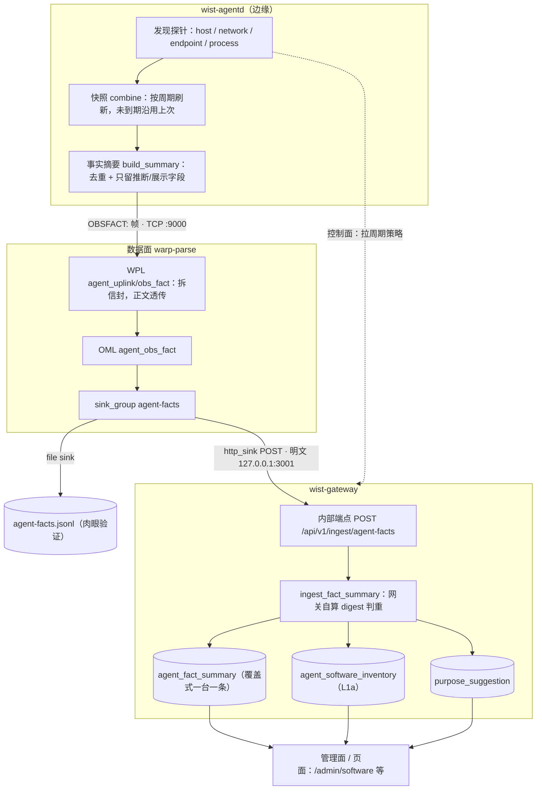

# 资产发现数据流（现状）

把「发现」到「清单 / 用途」的落地路径画清楚：**一次上报，多个消费者**。本文只描述**当前已通**的链路与缺口，不描述待做形态。

> 两个词别混：**「发现」**是 agentd 的探针（本机事实）；**「资产清单」**是网关对事实摘要做的 **L1a 机械归并**。
> 发现侧**只压摘要、不建清单**；清单完全在网关算，且**只有摘要这一条通道**（原文通道待做）。

## 1. 全链路

## 2. 分段说明

| 段 | 位置 | 做什么 |
|---|---|---|
| 发现 | `wist-agentd/src/discovery/` | 探针 `host / network / endpoint / process`（`[discovery] *_enabled` 控制；container/k8s 当前关闭），产出 `DiscoveredResource` |
| 快照 | `discovery/runtime.rs`、`cache.rs` | 把各探针输出拼成 `DiscoverySnapshot`；**只刷到期的探针**，未到期沿用上次输出（少交一个探针等于把它上次的资源删掉） |
| 摘要 | `reporting/fact_summary.rs` | `build_summary()`：去重压成 `process_executables` / `listen_ports` / `packages`（探针未实现，恒空）+ `os/arch/process_count`；另带 `host_id/host_name/network_addresses`（仅留痕，不进摘要） |
| 上行 | `runtime/daemon.rs::report_fact_summary` | 组 `{schema, agent, ts, seq} OBSFACT: <json>` 帧，走数据面 TCP sink |
| 解析 | `data-plane/models/wpl/agent_uplink/parse.wpl` | `rule obs_fact`：`symbol(OBSFACT:)` + `chars:body\0`，**正文不拆字段**（契约可演进） |
| 建模 | `data-plane/models/oml/agent_obs_fact.oml` | 只把信封拆成 `schema/agent_id/observed_at/seq/category/body` |
| 分流 | `data-plane/topology/sinks/business.d/agent_facts.toml` | `sink_group agent-facts`，`oml=["agent_obs_fact"]` |
| 落两处 | 同上 | ① `file_json_sink` → `agent-facts.jsonl`（肉眼验证）；② `gateway_facts_sink`（`sink.d/22-gateway_facts_sink.toml`）POST 到网关 |
| 校验 | `wist-gateway/src/api/ingest.rs` | 只做两件正确性检查：`agent_id`/`instance_id` 对得上登记表、**信封自称 == 正文自称**（**不是认证**） |
| 派生 | `src/api/agent_ops.rs` | `ingest_fact_summary`：网关**自算** `content_digest` → 判重 → 覆盖写 `agent_fact_summary`；内容变才 `refresh_software_inventory`（`app/inventory.rs::derive_inventory`）+ 重跑用途推断 |
| 展示 | `src/api/software_ops.rs` 等 | 「按机器看软件」「按软件看机器」「用途」三类视图 |

**控制面**（与上行无关，只给周期）：agentd 拉 `POST /api/v1/agent/discovery-policies:poll` 拿各方向观测周期；网关未配表回 503，agentd 用内建默认值。它**不接管探针开关**。

## 3. 关键性质（设计意图，非巧合）

- **判重在网关、不在 agent**：agentd **无条件周期全量**上报（只按最小间隔节流），网关从内容重算 digest 作幂等键 —— agent 侧算法退化不会造成静默漏报。
- **摘要只留当前、覆盖式**：一台一条，不记历史。
- **清单是摘要的派生投影**：内容变才重建，随时可由摘要重算。
- **失败要显形**：网关对坏记录回非 2xx → wparse 重试并最终落 `data/rescue`；agentd 用 file sink 时事实帧**报错**（不像指标静默跳过）。

## 4. 现状缺口

| 缺口 | 影响 |
|---|---|
| **原文快照**（`ReportDiscoverySnapshot`）**没有 receiver** | 「资产原文 → 中心整理」这条路还没通，目前只有摘要这一条 |
| `packages` 探针未实现 | 已装包集合恒空（**空 = 没采，不是没装**，见 `B119`） |
| 数据面接入**无鉴权** | 网关订阅端不校身份（有意接受的降级窗口，见交付计划 §9） |
| container / k8s 探针关闭 | 容器/编排资产不在当前发现范围 |
| Linux `/proc/<pid>/comm` 只有 basename | `process_path` 类规则目前只在 macOS 成立（见 `B119`） |

## 5. 模型落点

本链路在模型里表达为 **`runtime/global/asset-discovery-dataflow.mju`** 的 `dataflow AssetDiscoveryDataFlow`：

- 端点用**模型条目**：`node<message> ReportAgentFactSummary`、`node<flow> IngestAgentFactSummaryFlow`、`node<resource> Control.AgentFactSummary / AgentSoftwareEntry / PurposeSuggestion`，数据面作 `node<external> WarpParseDataPlane`。
- 边：`write`（agentd→数据面）、`trigger`（数据面→ingest flow）、三条 `write`（flow→三张派生表）、`emit`（flow→数据面，回 `FactSummaryAccepted`）。
- **为什么不用 `topology.mju` 的 `link<data>`**：那要求两端是**主机节点**，而本链路要表达的是「什么数据经哪一步变成什么」，端点是 message/flow/struct。二者不是同一件事，故分列（`link<data>` 仍无法以拓扑 `node` 为端点）。
- **为什么声明 `domain Reporting`**：端点多在 Reporting 域，未限定名按 Reporting 解析，`node<flow>` 与其 interface 输出（`FactSummaryAccepted`）才同域对得上。

## 6. 关联文档

- [`./agent-purpose-inference.md`](./agent-purpose-inference.md) §3：事实从哪来（摘要/原文两条载荷）。
- [`./agent-work-delivery-plan.md`](./agent-work-delivery-plan.md) §4.1：事实上报统一走数据面；§8.2：资产清单按层归属；§9：数据面接入无鉴权风险行。
- [`./report-discovery-snapshot-schema.md`](./report-discovery-snapshot-schema.md)：原文快照（待做的哪条路）的 schema。
- [`../foundation/jumo-verification-model.md`](../foundation/jumo-verification-model.md)：把模型做成机器可检规约（本条 dataflow 是其中一个可检端点）。
