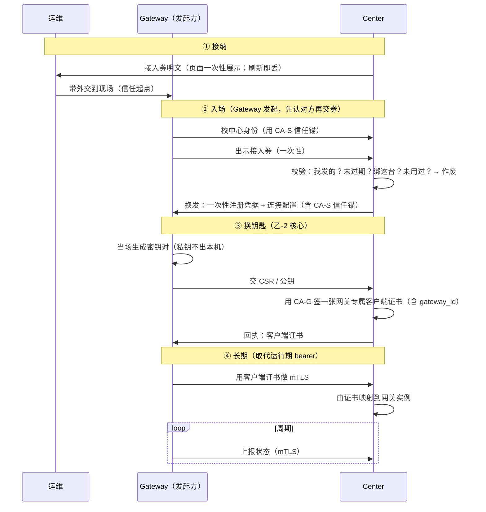

# Gateway 安全注册到 Center（客户端证书 mTLS）

> **状态**：**已落地**（2026-10-04）；实现索引见 §11。
> **取代**：[`gateway-enrollment-flow.md`](gateway-enrollment-flow.md) 的**运行期凭据**部分（原 `RUNTIME_TOKEN` bearer `wic_` / `credentials:renew`）。
> **背景**：见 CR-003（`../foundation/cross-repo-issues.md`）——网关独立运行、链路承载在宿主侧 `wist-gwlinkd`。

## 1. 目标与前提

- **Gateway 默认独立运行**；与 Center 集成是**可选的、事后的一步**，入口就是 **link-upstream**。
- 新目标：**安全地把 Gateway 注册到 Center**。
- 与旧模型（`GatewayOnboardingFlow` 的「Center 创建设备即下发容器 + 安装注入 bootstrap，容器自做 init」）**不同**：那套以「容器是发起者、随安装注入」为前提，**不再是目标形态**。

## 2. 两组彼此独立的信任问题

| 问题 | 靠什么 | 信任根 |
|---|---|---|
| 网关**凭什么信对面是中心**？ | 中心**服务器证书**（TLS） | `CA-S` |
| 中心**凭什么信对面是那台网关**？ | 网关**客户端证书**（mTLS） | `CA-G` |

**一把 CA 只干一件事（单开）**：`CA-S` 只签中心服务器证书，`CA-G` 只签网关客户端证书。吊销互不影响。

## 3. 两级凭据（时间维度）

| 阶段 | 凭据 | 形态 | 生命周期 |
|---|---|---|---|
| **入场** | 接入券 `link`（前缀 `link_`，旧名 `bootstrap`） | **共享秘密**（一次性券） | 一次性、**短命**（默认 15 分钟，可配）、绑定到该网关、带外交付 |
| **长期** | 网关**客户端证书** | **公私钥**（每网关一张） | 有效期 + 可轮换 + 可吊销 |

- **只共享 CA，不共享证书**：`CA-G` 是全局唯一的信任根；**每台网关各自生成密钥对、各自拿一张证书**。
- **私钥永不出网关**。
- **证书绑定 `gateway_id`**（`instance_id` 随运行期变，不进证书）。

## 4. 端到端时序

## 5. 关键不变量

1. **先认证对方，再交凭据**——先校中心（`CA-S`），再出示接入券。
2. **接入券**：一次性 + 短命 + 绑定 + 带外。
3. **私钥永不出网关**。
4. **CA 共享，证书唯一**（每网关一张）。
5. **长期身份 = 私钥/证书**，不可复制；**可单点吊销**（走 `CA-G`）。
6. **认证 ≠ 身份**：`ident_` 一类自持标识**不构成**"能否入网"的依据；决定权在那张 **Center 签发、带外送达**的接入券。

> **命名说明**：这张券叫 **接入券（link token）**，不叫 bootstrap —— 它只在**首跑接入**（`link-upstream`）时用一次；
> gateway 容器的部署/启动本身**不需要**它（发起方在宿主侧 `wist-gwlinkd`）。旧名 `bootstrap` 已改名（见 §11）。

## 6. 相对旧设计/现状的**变更**（待落地清单）

| 项 | 旧 | 新 |
|---|---|---|
| 运行期凭据 | bearer `RUNTIME_TOKEN`（`rt_`/`wic_`） | **删除**；长期身份 = 客户端证书 |
| 凭据轮换 | `POST /gateway/credentials:renew`（换 bearer） | **证书轮换**（见 §7） |
| `status` / `upgrade-plan` / `upgrade-result` 鉴权 | `Bearer <runtime>` | **由客户端证书认人**（mTLS） |
| Center 认证网关 | 比 bearer hash | **校客户端证书**（`CA-G`），映射到实例 |
| 接入券 TTL | 无 | **短 TTL**（默认 15 分钟，可配） |
| 接入券明文交付 | 进 create API 响应 | **仅 Center 页面一次性展示**（刷新即丢；再取即 rotate） |
| 接入券命名/前缀 | `bootstrap` / `boot_` | **`link` / `link_`**（名实相符：接入，不是启动） |
| 集成发起方 | 容器（随安装注入） | **网关侧**（宿主常驻 `wist-gwlinkd` 承载） |

**保留不变**：`link-upstream` 路线；接入券 → 注册凭据（一次性）→ 长期 的两级换发节奏；接入券明文不进 URL query；中心只存 `sha256`。

## 7. 轮换与吊销

- **证书轮换**：到期前，网关**再生成一套密钥对** → 用**旧证书**证明身份 → 交新 CSR → 换新证书；
  旧证书在新证书生效后作废。
- **吊销**：走 `CA-G`（CRL/吊销列表）；单网关可被独立吊销，不影响其它网关。

## 8. 接入券的交付

- 明文**显示在 Center「连接 Gateway」页面**，**一次性展示**；页面只在内存持有，**刷新即丢**。
- 由于 Center 只存 `sha256`，刷新后**无法再显示同一张**——要再取只能**轮换**（重新生成、旧券作废）。
  > 因此建议：由**独立的「生成 / 轮换」动作**产出明文（而非塞进 create 响应）——更贴合"only-once"，也不违背"不进 create 响应"。

## 9. 与模型（`wist-design/jumo`）的关系

`GatewayOnboardingFlow` 里的 ④「工程师携带 → ⑤ 安装注入容器」在**本设计下不再适用**（发起方改为网关侧、凭据改为证书）。
已同步修订（2026-10-04）：⑤/⑦/⑧ 的**发起方从容器改为网关侧常驻**，新增「生成密钥对 → CSR → 签证书」一步；
`GatewayBootstrapToken` 补 TTL/状态；`GatewayCredentialBundle` 改为只带客户端证书、
`RegisterGateway` 改要 `certificate_signing_request`、`RenewGatewayCredential` 改证书轮换，并新增
`GatewayClientCertificate`。`jumo verify` 全绿。见 §6、§11。

> **待对齐（模型）**：代码/线协议已把这张券改名为 **接入券 `link`**（`GatewayBootstrapToken` → 拟
> `GatewayLinkToken`，含 `link_ttl_seconds` 等）；`wist-design/jumo` 模型实体与 `impl/usecases.json`
> （`IssueBootstrapToken`/`RotateBootstrapToken` 等）尚未同步，待一轮模型对齐。

## 11. 落地情况（2026-10-04，2026-10-05 更新）

- **接入券改名（2026-10-05）**：网关一次性券由 `bootstrap`/`boot_` 改为 **接入券 `link`/`link_`**
  （名实相符：它在**首跑接入**用一次，容器部署/启动不需要它）。中心路由 `.../link-token`、字段
  `link_token`/`link_expires_at`、配置 `security.link_ttl_seconds`、库列 `link_token_hash`/`link_token_expires_at`；
  gwlinkd 环境变量 `WIST_GWLINKD_LINK_TOKEN`（旧名回退一版）。TTL 可配、**默认 15 分钟**。
- **契约**：网关↔中心的注册/凭据 wire 类型落在 `wist-contracts::gateway_control`（**手工维护**；`wist-control`
  的生成因 `jumo-code generate` 阻塞，见 `wist-gateway/docs/design/agent-identity-mtls.md` §7）。
  已发布 **`wist-contracts 0.2.0`**：`GatewayCredentialBundle` 只带 `certificate`；`RegisterGateway` 要 CSR；
  `RenewGatewayCredential` 改证书轮换；新增 `GatewayClientCertificate(+Status)`。
- **中心（`wist-center` `0.4.0-alpha`）**：CA-G 签发 / 轮换客户端证书；`status` / `upgrade-plan` /
  `upgrade-result` / `agents/status` / 已置备的 `link-upstream` 改为**由客户端证书认人**；新增可选
  **服务端 TLS/mTLS 监听（甲）**（`server.server_cert_path` / `_key_path` → HTTPS + 校 CA-G，
  握手后把网关身份注入请求）。
- **网关侧常驻（`wist-gwlinkd`）**：注册 / 轮换时生成密钥对 + CSR，落盘证书+私钥（0600，
  私钥不出本机）；其后所有网关面调用走 **mTLS**；首跑注册可重试（落盘 RegistToken，register 失败后免接入券）。
- **验证**：`wist-center-stack/dev`（`start-gwlinkd.sh`）端到端跑通：注册换证 → mTLS status →
  证书轮换 → 升级拉取/驱动/回执。

## 10. 相关文档

- [`gateway-enrollment-flow.md`](gateway-enrollment-flow.md)（旧版，运行期部分被本文取代）
- [`agent-gateway-protocol.md`](agent-gateway-protocol.md)（agent↔网关 已是 mTLS/客户端证书，本文与之同构）
- [`../foundation/cross-repo-issues.md`](../foundation/cross-repo-issues.md)（CR-003）
- [`../foundation/security-model.md`](../foundation/security-model.md)
