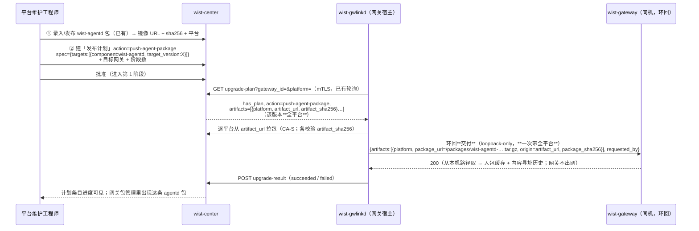

# Agent 包下发：中心托管 → 推送到网关包管理（发布 ②）

> **状态**：**设计**（2026-10-09）。落地跟踪见 §9。
> **关联**：[`center-content-delivery.md`](./center-content-delivery.md)（**分层：中心内容由 gwlinkd 取、网关只托管**）、
> [`agent-upgrade-and-packages.md`](./agent-upgrade-and-packages.md)（网关托管 agent 包：来源 → 托管 → 升级选包）、
> [`gateway-upgrade-and-releases.md`](./gateway-upgrade-and-releases.md)（发布 ①：中心对网关的升级；§7.1/§8 挂出本特性）、
> [`gateway-onboard-request.md`](./gateway-onboard-request.md)（同款「gwlinkd 环回拉取 + 环回写」通道）、
> [`gateway-status-report.md`](./gateway-status-report.md)（网关自述面）、
> [`../foundation/cross-repo-issues.md`](../foundation/cross-repo-issues.md) **CR-003**（宿主侧常驻 `wist-gwlinkd`）。

## 1. 要解决的问题

中心「发布」页把「发出去」分成两种（`gateway-upgrade-and-releases.md` §8）：

| # | 发什么 | 去向 | 谁决定 | 现状 |
|---|---|---|---|---|
| ① 升级安装 | `wist-gateway-stack` / `galaxy-ops` / `galaxy-flow` | 推到网关（宿主侧）升级安装 | **中心** | 已通（升级计划 → 批准 → 网关拉取 → gwlinkd 执行） |
| ② Agent 包下发 | `wist-agentd` | 推到**网关的包管理** | **gateway** | 页面已出，**后端待接通** |

本设计补 **② 的后端**，两个预期：

1. **能把中心托管（镜像）的 `wist-agentd` 包推进选定网关的包管理** —— 之后新装 / 升 Agent 从网关自己的包管理取件；
2. **这件事组织成一份发布计划** —— 可灰度（先金丝雀）、可批准/推进、可看**逐网关**进度。

关键语义：**②只把包交给网关，"升不升 / 何时升"由网关决定**（区别于 ① 由中心直接推下去升级）。
②落完成后，网关侧走它**自己的** agent 升级流（`target = agent` 的 rollout）决定是否升；中心不再参与那一步。

## 2. 关键约束：中心是 pull-based，执行者在网关宿主

- 中心 ↔ 网关现在是**网关主动入站**：`register` / `status` / `upgrade-plan` / `credentials:renew` 全部是网关发起、中心应答。
  中心**没有出站到网关的 HTTP 通道**（`wist-center` 唯一出站客户端是给 VictoriaMetrics 的）。
- 网关多在内网 / NAT 后，中心**够不到**它们；给每台网关配一套管理凭据（admin token / mTLS）既扩大泄露面，也逆架构。
- `wist-gwlinkd` 是宿主机上**唯一与中心对话的执行者**（CR-003 R1），**纯出站**；它用 `gateway_self_endpoint`
  环回够得到同机的网关容器（`self-state` / `link-request` / `linkd-status` 已如此）。

⇒ **"把 agentd 包推到网关"不能是中心直推，只能是"中心表达意图（计划）、gwlinkd 拉取后在环回上把包写进网关包管理"。**

这也与 `agent-upgrade-and-packages.md` 的**三层地址**（来源 → 网关托管 → 下发地址）同口径：中心镜像地址是**来源**，
网关把它拉进自己的包管理才是**托管**，对 agent 的下发地址由网关派生。

**但「取包」这一步由谁做**，见 [`center-content-delivery.md`](./center-content-delivery.md)：中心内容由**持有中心信任**的
`wist-gwlinkd` 出站取（它持 CA-S、是唯一面向中心者），网关**不出网**、只从「本机落地」取并托管。

## 3. 方案：复用发布计划，gwlinkd 取包并交付网关托管

要点：

1. **取包由 gwlinkd 完成**（它持 CA-S、是唯一面向中心者）：出站拉中心镜像地址 + 逐平台校验 `artifact_sha256`。
   网关**不出网**——它仍走 `set_agent_install_package` 那套「来源 → 拉取 → 缓存 → 记历史」，只不过这次「来源」是
   gwlinkd 落地的**本机路径**（`/packages/<file>`）。职责划分与理由见 [`center-content-delivery.md`](./center-content-delivery.md)。
   > **为什么不是网关自己拉中心地址**：2026-10-09 真实事故——网关不信任中心私有 CA，
     `https://127.0.0.1:3100/...` 取包报 `error sending request`，环回回 502。根因是「取包」落在了不持中心信任的组件上。
2. **② 下发的是该版本的「全平台」制品**：网关替 **Agent 机队**托管各平台的包，机队平台可 ≠ 网关自己主机的平台，
   故契约用 `artifacts`（列表）而非单值 `artifact_url`；① 升级仍用单值（网关本机就一个平台）。
2. **发布计划复用 `Control.Rollout.RolloutPlan`**，只新增一个 `action`。`rollout/items.mju` 的模块注释明说
   「将来新增动作只需加 action，不用再建一套计划」—— ② 就是这句话的兑现。
3. **写通路走网关环回端点**（loopback-only），照抄 `linkd-status` / `link-request` 的成熟模式，
   **不需要中心持有网关管理凭据**（绕开 `gateway-upgrade-and-releases.md` §7.1 说的那个缺口）。

## 4. 发布计划（② 复用 ① 的一整套）

| 维度 | 取值 |
|---|---|
| `action` | `push-agent-package`（与网关侧 rollout 的 action 目录同域；今天只有 `upgrade`） |
| `spec` | 与升级同形：`{"targets":[{"component":"wist-agentd","target_version":"X"}]}` —— 让 `first_upgrade_target` + `resolve_release_artifact` / `resolve_release_artifacts` **原样复用** |
| `target_ids` | 选定网关（`gateway_id`）清单 |
| `phases` | 灰度阶梯（1 个金丝雀 → 扩大 → 全量），闸门复用（首段 `manual`，其后 `all_succeeded`） |
| `batch_size` | 阶段内并发（节流），复用 |
| 条目终态含义 | `succeeded` = 「网关已把包收进包管理」，**不是**「已升级」 |

**"谁决定升级"不变**：②的终态只到"包已交付"，之后网关自行决定升不升。

> 备选：单开 `AgentPackagePushPlan` 模型。**不采用** —— 与通用 rollout 重复，且要重写创建/批准/推进/查看一整套。

## 5. 载荷与接口面

### 5.1 网关面（gwlinkd 拉取，已有端点扩字段）

`GET /api/v1/gateway/upgrade-plan?gateway_id=&platform=` 的响应 `GatewayUpgradePlan` **扩三个可选字段**：

| 字段 | 说明 |
|---|---|
| `action` | 计划动作（`upgrade` / `push-agent-package`）。gwlinkd 据此分派执行器。缺省 = 老中心，按 `upgrade` 处理 |
| `artifact_sha256` | `artifact_url` 的期望摘要。**②（`push-agent-package`）必带**；①不带（给 ① 加摘要会改变其既有取件/校验行为）。中心从**同一条** release 记录带出。见 §5.4 命名 |
| `artifacts` | `[{platform, artifact_url, artifact_sha256}]`：该版本**全部平台**（② 用；列表为空时序列化省略）。中心按平台去重、按平台名排序；缺摘要 / 无平台的记录跳过（网关要校验，缺摘要无法安全交付）。① 不带（网关本机一个平台，用单值 `artifact_url`） |

> **§5.4 命名对齐**：契约字段叫 `artifact_sha256`（与既有 `artifact_url` 成对；gwlinkd 早已 `#[serde(flatten)]`
> 宽容读取 `artifact_sha256`）。gwlinkd **用它去取包并校验**；到**网关环回交付**时，地址改成本机路径
> （`package_url = /packages/<file>`）、中心地址进 `origin`、摘要进 `package_sha256`（网关 `SetAgentInstallPackageArtifact` 的字段名）。

其余字段复用：`has_plan` / `plan_id` / `component`（= `wist-agentd`）/ `to_version` / `artifact_url`（中心按**网关声明的平台**派生，多平台包挑对平台）。
`platform` 由 gwlinkd 自述（`HostTarget::target_triple()`），中心据此挑平台，**挑不到就不给地址**（宁可不派，也不派错平台制品）。

> **② 的全平台来自 `artifacts`（不是 `artifact_url`）**：单值 `artifact_url` 仍按**网关本机平台**派生（供 ① / 兼容旧），
> 而 `artifacts` 是**该版本已发布的全部平台**（机队平台可能 ≠ 网关主机平台）。gwlinkd 优先用 `artifacts`，为空才回落单值 + 本机平台（见 §7 `target_artifacts`）。

### 5.2 网关侧新增：环回**交付**端点（不是「取包」端点）

| 面 | 方法/路径 | 鉴权 | 用途 |
|---|---|---|---|
| 环回（gwlinkd） | `POST /api/v1/gateway/agent-package` | **loopback-only** | gwlinkd 把**已取到**的中心包交付给网关托管 |

- 载荷与既有 admin 端点同形，只把「来源」换成 gwlinkd 落地的本机路径，另带中心地址作审计：
  `{artifacts:[{platform, package_url:"/packages/<file>", origin:"https://<中心>/...", package_sha256}], requested_by}`。
  **一次 POST 带全部平台**——网关侧**整批一次提交**：任一不合格整体拒绝落库（各平台的本地缓存文件在拉取阶段逐个写入，全批一致性见 §10）。
  - `package_url` = 网关**能取**的来源（本机绝对路径，一等来源）；
  - `origin` = 中心镜像地址（**provenance/留痕**，网关**不**据此取包）。
- 路由注册 `wist-gateway/src/api/mod.rs`；`binding.mju` 以「手加 + 模型留档」登记（同 `linkd-status`）。
- **内核复用**：仍是 admin 端点 `set_agent_install_package` 那一套（校验 + `fetch_into_package_cache` + 落库 + 记历史）
  **同一份** `pub(crate) async fn` —— 网关侧**无新取包逻辑**，admin / 环回同内核。
  （「取包」那一步的差异全在**上游**：admin 由人填地址、环回由 gwlinkd 先把内容落到本机路径。）

### 5.3 中心侧（无新端点）

| 面 | 方法/路径 | 说明 |
|---|---|---|
| 管理面 | `POST/GET /api/v1/admin/rollout-plans*` | **复用**（建 / 列 / 批准 / 推进 / 查看）；`action` 放开到任意值 |
| 网关面 | `GET /api/v1/gateway/upgrade-plan` | **复用**，回带 `action`；②（`push-agent-package`）再回带 `artifact_sha256` |

`upgrade_plan_for` 里：地址两种动作都照样派生（① 用 `resolve_release_artifact` 按网关平台挑一条）；
**② 另用 `resolve_release_artifacts` 取该版本全平台**填 `artifacts`；**摘要只在
`action=push-agent-package` 时回带**（取同一条 release 记录的 `package_sha256`）—— ① 升级路径不回带，避免改变其既有取件/校验行为。

## 6. 决策与取舍

| 决策点 | 采用 | 备选 | 理由 |
|---|---|---|---|
| 下发通路 | 网关 loopback 端点（gwlinkd 环回写） | 中心直推 `POST /admin/agent/install-package` | 采用方案不逆架构、不分布管理凭据、与既有三通道同构；备选要中心有出站到内网网关的通路 + 每网关管理凭据（大改，且网关在 NAT 后不可达） |
| 凭据 | loopback（同机隐含可信） | gwlinkd 配置持 `gateway_admin_token` | 备选要多下发一个平台级管理密钥，泄露面更大 |
| 计划载体 | 复用 `RolloutPlan` + 新 action | 单开 `AgentPackagePushPlan` | 复用已通的一整套（阶段/闸门/进度）；模型注释本就是这个意图 |
| **取包方** | **gwlinkd 取（持 CA-S）→ 交付网关托管** | 网关自己拉中心地址 | 把「取包」放在持中心信任、且唯一面向中心的组件上；网关不背中心信任。网关自己拉会撞中心私有 CA（2026-10-09 事故）。见 `center-content-delivery.md` |
| 交付形态 | 共享投放目录 → 本机路径（网关仍"从来源取"） | 环回塞字节 | 保持网关**同一契约、同一内核**（本机路径是一等来源）；复用现有 `PACKAGE_DIR:/packages:ro` 挂载 |
| 建计划时机 | 工程师在 ② 面板**显式**建（对齐 ①） | 发布包时**自动**生成全量计划 | 显式可控、可先金丝雀；自动生成可作后续便利项 |
| **失败重试** | 中心**重派**：为失败目标**新建一份补跑计划**（新 `plan_id`、单阶段、直接放行） | 原地把失败条目改回 `pending`、计划重开 `rolling` | gwlinkd 对每份计划**只驱一次**（落盘游标 `last_plan_id`，② 连失败也落）—— 同一 `plan_id` 改状态在网关看来还是那份计划，会被**静默跳过**：中心显示待派、网关永不重跑（最难查的假重试）。新 `plan_id` 才真的重驱；原计划原样留作历史。网关侧的「原地重开」之所以成立，是因为那边不跨进程记 `last_plan_id` |

## 7. 代码对应

| 侧 | 位置 |
|---|---|
| 契约 | `wist-control` `gateway_upgrade_plan.rs`（`GatewayUpgradePlan` 加 `action` / `artifact_sha256` / `artifacts`（+ `GatewayUpgradeArtifact`），v0.13.0） |
| 模型 | `static/control/module/gateway/supervision/items.mju`（同上）；`static/control/module/rollout/items.mju`（action 语义补 `push-agent-package`）；`runtime/subsystem/WistCenter/usecase.mju`；网关环回写入口 `static/control/module/gateway-app/agent-package-interface/*.mju`（`GatewayApp.AgentPackageInterface.ReceiveAgentPackage`，未 bind）+ `runtime/subsystem/WistGateway/subsystem.mju` |
| 中心发布（既有） | `wist-center/src/api/admin_ops.rs`（`admin_publish_release`，`component=wist-agentd`）、`wist-center/src/infra/{package,artifacts}.rs` |
| 中心计划（复用） | `wist-center/src/api/rollout.rs`（`build_plan` / `plan_view` / `progress_plan_after_terminal_result`）、`wist-center/src/api/admin_ops.rs`（`admin_create_upgrade_plan` 等） |
| 中心派生地址 | `wist-center/src/api/gateway_ops.rs`（`upgrade_plan_for` → ①`resolve_release_artifact` 按平台挑一条 / ②`resolve_release_artifacts` 取全平台） |
| 动作常量 | **`wist-control`** `Control.Rollout`：`ACTION_UPGRADE` / `ACTION_PUSH_AGENT_PACKAGE`（中心与 gwlinkd **共用一份**，钉在 `tests/model_contract.rs`） |
| 中心路由 | `wist-center/src/api/mod.rs`（`/api/v1/admin/rollout-plans*`、`/api/v1/gateway/upgrade-plan`） |
| 网关写包管理 | `wist-gateway/src/api/admin_ops.rs`（`set_agent_install_package`）、`wist-gateway/src/api/install_package.rs`（`fetch_into_package_cache`）；**新增**环回**交付** handler + `wist-gateway/src/api/mod.rs` 路由。**网关侧无新取包逻辑**（来源=本机路径，走既有内核） |
| 网关环回范式 | `wist-gateway/src/api/linkd_status.rs` / `link_request.rs`（`client.ip().is_loopback()` 把关） |
| gwlinkd | `wist-gwlinkd/src/main.rs`（`run` 的 `get_upgrade_plan` 分支按 action 分派；`drive_agent_package_push` 用 `target_artifacts` 取**全平台**目标 → `deliver_agent_package` 逐平台取包 + 校验摘要 + 落地、再一次 POST 交付）、`center.rs`（`get_upgrade_plan` 解析新字段；`artifact_http_client()` 复用既有 CA-S 客户端）、`agent_package.rs`（环回**交付** client，仿 `link_request.rs`；`push(&[AgentPackageItem])` 一次带全平台）、`state.rs`（回报 + 幂等游标）、`target.rs`（`HostTarget::target_triple`）；**新增**投放目录配置 |
| 前端 | `wist-center-web`：`AgentPackagePushPanel.tsx`（占位 → 真面板，接 `createUpgradePlan`）、`ReleasePage.tsx`（② tab 已就位）、批准/推进/逐台进度复用 `UpgradePlanApprovePage.tsx`（对 ①/② 计划一视同仁）、表单样式抽到 `PlanForm.module.css` |
| 共享内核 | `wist-release`（`package` / `rollout` / `plan` 模块）—— 中心与网关共用一份 |

## 8. 验收

1. 中心录入 `wist-agentd` 三平台包 → ② 建计划（目标若干网关、阶段数 N）→ 批准。
2. 计划的 `artifacts` = **该版本全部平台**（每项带 `platform` / `artifact_url` / `artifact_sha256`）；单值 `artifact_url` 仍按网关本机平台派生。
   **gwlinkd**（非网关）逐平台出站取包并校验摘要。
3. gwlinkd 落盘 + **一次**环回交付全部平台 → 网关包管理出现各平台 agentd 包（版本 / 架构读得出）：
   `GET /api/v1/admin/agent/install-packages` 能查到、`GET /api/v1/agent/packages/{package_id}` 能下；
   网关侧**无中心出网**（取的是 gwlinkd 落地的本机路径）。
4. 中心计划条目转 `succeeded`；按闸门推进到下一阶段。
5. **不越权语义**：②只放包，**不**触发 agent 升级；"谁升级"仍由网关自己的 agent 升级流决定。
6. 失败可定位：目标版本**没发布过** → 不带地址（拒绝建计划或明确报错）；摘要不符 → 网关 `400` 且中心条目 `failed`，
   detail 可见。
7. 非环回请求打到环回端点 → `403`。

## 9. 落地跟踪

> **分层改版（2026-10-09）**：取包责任由**网关**改到 **gwlinkd**（唯一持 CA-S 者）→ 交付网关托管。
> 起因：网关取 `https://<中心>`（私有 CA）报 502。设计见 [`center-content-delivery.md`](./center-content-delivery.md)。
> 下方 [x] 是**改版前**（网关自己取）的实现；取包/交付两侧需按新分层返工，见 **[ ] 改版返工**。

- [x] **改版返工（按 [`center-content-delivery.md`](./center-content-delivery.md)，2026-10-09）**：
  - [x] gwlinkd：`drive_agent_package_push` 改用 `CenterClient::artifact_http_client()` 取 `artifact_url` + 校验 `artifact_sha256`；字节落到投放目录（宿主 `agent_package_drop_dir`）。
  - [x] gwlinkd：环回交付载荷改为 `package_url=<容器可见本机路径>` + `origin=<中心地址>`；新增**投放目录 / 容器前缀**两项配置（`agent_package_drop_dir` / `agent_package_container_dir`，缺则 ② fail-closed）+ 文件名取制品地址末段。
  - [x] 网关：环回端点接受 `origin`（provenance，记历史的 `source`；设置里的来源仍是网关能取的本机路径）；模型 `ReceiveAgentPackage` 同步加 `origin`；**内核不变**（来源 = 本机路径）。
  - [x] 测试：gwlinkd（取包 → 落地 → 交付、网关拒收、未配投放目录 fail-closed）+ 网关（`origin` → provenance）。
  - [x] **部署接线 + 清理**：栈把 `${PACKAGE_DIR}`（宿主）与 `GWLINKD_AGENT_PACKAGE_CONTAINER_DIR`（容器 `/packages`）由 `scripts/init-gwlinkd.sh` 渲染进 `gwlinkd.toml`（模板 + `vars.yml`/`merged_vars.yml`）；交付成功后按 `agent_package_drop_keep`（缺省 12，`0` = 不清理）保留投放目录里最新若干份（gwlinkd 侧 best-effort 清理）。
- [x] 契约 / 模型：`wist-control` `GatewayUpgradePlan` 加 `action` + `artifact_sha256`（**v0.12.0** + CHANGELOG）+ 模型 `items.mju` 同步 + 契约测试。
- [x] 契约 / 模型（**多平台**）：`GatewayUpgradePlan` 再加 `artifacts: List<GatewayUpgradeArtifact>`（`{platform, artifact_url, artifact_sha256}`；`skip_serializing_if = empty`）—— ② 下发该版本**全平台**（网关替 **Agent 机队**托管；机队平台可 ≠ 网关主机平台）；① 仍用单值。模型 `items.mju` 同步（+ `GatewayUpgradeArtifact`），`jumo verify` 通过；契约测试（多平台往返 + 空清单序列化省略）。**待发 `wist-control 0.13.0`**。
- [x] 中心（**多平台**）：`upgrade_plan_for` ② 时填 `artifacts = resolve_release_artifacts(...)`（该版本全平台，按平台去重 / 按平台名排序，跳过无平台 / 无摘要的记录）；① 为空。单测：② 带全平台 + ① 为空、`resolve_release_artifacts` 去重 / 排序 / 跳过。
- [x] gwlinkd（**多平台**）：`deliver_agent_package` 逐平台取包 / 校验 / 落盘，最后**一次** POST 交付全平台（网关侧整次原子生效）；`target_artifacts` 优先 `artifacts`、为空才回落单值 + 本机平台。测试：多平台端到端（两平台一次交付）、`target_artifacts` 优先 / 回落。
- [x] **鲁棒性加固（P3/P5/P6/P7）**：
  - P3 下架：① 与 ② 都跳过 `expired` 的 release（`is_dispatchable`）；测试覆盖 ② 与 ①。
  - P5 取最新：② 同平台按 `published_at` 取最新（抽成纯函数 `artifacts_for_version`，**不依赖 store 排序**，乱序单测）。
  - P6 保留数下限：`agent_package_drop_keep` 抬到不低于本批份数，`keep` 偏小不误清本次交付。
  - P7 失败也清：交付失败后仍按数量清旧（best-effort），免得反复失败把投放目录撑爆。
- [x] 模型（网关环回写入口）：`Control.GatewayApp.AgentPackageInterface.ReceiveAgentPackage`（`static/control/module/gateway-app/agent-package-interface/*.mju`；**刻意未 `bind`**，与 `GwlinkdStatusInterface` / `LinkRequestInterface` / `SelfInterface` 同口径）+ 登记进 `runtime/subsystem/WistGateway/subsystem.mju`；`jumo verify` 通过。环回面按惯例**不进** `binding.mju` / `impl/usecases.json`（无 usecase）。
- [ ] 发布接线：`wist-control 0.13.0` 发到 registry 后，把 `wist-center` / `wist-gwlinkd` 的 `wist-control` 从 `path` 切回 registry 版本（**本地当前用 `path` 联调**）。属**发布动作**，需 crates.io 凭据。
- [x] `wist-gateway`：抽 `set_agent_install_package` 内核（`admin_ops::apply_agent_install_package`，admin 与环回**共用一份**）→ 新增 `POST /api/v1/gateway/agent-package`（loopback-only，`api/agent_package.rs`）+ 路由 + 契约 fixture 测试。
- [x] `wist-center`：`upgrade_plan_for` 按 action 回带 `artifact_sha256`（复用 `resolve_release_artifact`）+ `PUSH_AGENT_PACKAGE_ACTION` 常量；单测（②带 action+摘要、①只带地址）。
- [x] `wist-gwlinkd`：`center.rs` 直接用契约的 `action` / `artifact_sha256`（去掉 `#[serde(flatten)]` 宽容包装）→ 新 `agent_package.rs::AgentPackageClient`（环回 POST；动作常量取自 `wist-control`）→ `main.rs` 按 `action` 分派（`drive_agent_package_push`）→ 回报中心 + 落游标。测试：载荷形状契约、非 2xx、端到端与三条失败分支（网关桩 + 中心桩 + 游标）。
- [x] `wist-center-web`：② 面板（`AgentPackagePushPanel`）占位 → 真表单（选已托管 agentd 版本 + 网关范围 + 灰度阶段 + 执行约束），接 `createUpgradePlan({action: push-agent-package})`；批准/推进/进度复用「发布执行」页。共享表单样式抽到 `PlanForm.module.css`（①/② 共用）。
- [~] 端到端：**网关环回端点的真 socket e2e** 已加（`wist-gateway` `api::tests`：`…works_over_a_real_loopback_socket` 真 `127.0.0.1` 监听 + 真 HTTP + 载荷按 gwlinkd 形状 + store 落库 + **回执摘要** + **本地内容寻址副本落盘且摘要相符** + 幂等；`…rejects_a_bad_digest_over_a_real_socket`；`…rejects_a_malformed_body_over_a_real_socket`；`…defaults_the_actor_and_lists_every_platform_over_a_real_socket`）。**多进程真栈**（真 center + 真 gateway + 真 gwlinkd）是手动 ops —— runbook 见 §9.2。

### 9.1 已自动化的覆盖（seam → 测试）

| seam | 覆盖 |
|---|---|
| center → gwlinkd（`GET upgrade-plan` 的 JSON） | 两侧 path-dep **同一个** `wist_control::GatewayUpgradePlan` 类型 → serde 无法漂移；各自另有单测 |
| gwlinkd → gateway（环回**交付**载荷） | gwlinkd 侧钉序列化形状（`agent_package.rs` 测试，**多平台：一次 POST 带全平台**）+ gateway 侧钉反序列化 fixture + **真 socket e2e**（`agent_package_push_works_over_a_real_loopback_socket`、`…lists_every_platform_over_a_real_socket`）。**改版后**载荷带 `origin`（provenance）+ 本机路径来源，且 `artifacts` 为**列表**（全平台）；见 §9 改版返工 |
| gateway 环回护栏 | **真 socket**：真 `127.0.0.1` peer（axum 内建 connect-info）+ 非环回 403 + 无连接信息 403（fail-closed）；**生产注入层**：`wist-gateway/src/main.rs` `inject_connection_context` 单测（`#[cfg(test)] mod tests`，真实对端 → 环回/远端判定），钉住生产那份自定义注入，防 fail-closed 静默回归 |

### 9.2 真栈联调 runbook（多进程，手动 ops）

前置：该 gateway 已完成 onboarding（gwlinkd 持有客户端证书 + `gateway_self_endpoint` / `gateway_self_ca` 配好）；
**且 gwlinkd 已配 ② 交付**：`agent_package_drop_dir`（宿主投放目录，与网关容器挂载 `${PACKAGE_DIR}:/packages:ro` 指向同一份）+ `agent_package_container_dir`（该目录在容器里的路径，栈里 = `/packages`）。
缺这两项 ② 会 fail-closed（收到 `push-agent-package` 计划报错）。栈里已把这两项由 `scripts/init-gwlinkd.sh` 渲染进 `gwlinkd.toml`。

1. 起 center（`wist-center`，按其 `WARP_INSIGHT_CENTER_*` 配置）。
2. 起 gateway（`wist-gateway`，读 `wist-gateway.toml`）。
3. center 发布 agentd 包：`POST /api/v1/admin/releases/wist-agentd`（带平台 + 摘要；或 center-web「安装包管理」录入）。
4. 建 ② 计划并批准：center-web「发布 → ② Agent 包下发」创建 →「发布执行」批准（或 `POST /admin/rollout-plans` body `action=push-agent-package` → `/approve`）。
5. 起 gwlinkd（`wist-gwlinkd run`）。
6. 核验（期望证据）：
   - gwlinkd 日志：`event=UpgradeDriven action=push-agent-package` → `event=AgentPackagePushed plan_id=…`；
   - gateway 包管理：`GET /api/v1/admin/agent/install-packages` 出现该 agentd 包（版本 / 架构读得出；`/api/v1/agent/packages/{id}` 能下）；
   - center 计划详情：该 gateway 条目由 `dispatched` → `succeeded`，计划按闸门推进。

## 10. 风险与遗留

- **中心制品取包（已解）**：中心以私有 CA（CA-S）起 HTTPS 时，**网关**拉不动（无中心信任）。本分层把取包交给持 CA-S 的 gwlinkd，落地为**本机路径**后交付网关 —— 网关不再需要中心信任。见 `center-content-delivery.md`。
- **投放目录**：与网关容器 `PACKAGE_DIR:/packages:ro` 一致（宿主写、容器只读）。栈已接线；gwlinkd 交付**后**按 `agent_package_drop_keep`（缺省 12）清理旧份 —— **无论成败都清**（失败也清，免得反复失败把目录撑爆），且**保留数不低于本批份数**（`keep` 偏小也不会误清刚落的文件）。为避免多平台同名制品互覆，投放文件名前缀**平台**（`<platform>__<原名>`）。
- **下架（`expired`）的版本不再派发**：① 与 ② 的制品解析都跳过 `status == "expired"` 的 release 记录（`is_dispatchable`）—— 下架后新建的升级/下发不会拿到过期制品。进行中的计划若目标版本被下架，会表现为「拿不到地址」、条目 `failed`（可随时取消下架恢复）。只跳过**显式** `expired`（历史缺省视为可派发）。
- **中心制品下载端点无鉴权**（`gateway-upgrade-and-releases.md` §3 已知待收紧项）：现由 gwlinkd 取，一旦加鉴权，gwlinkd 已有客户端证书可直接用。
- **`GatewayUpgradePlan` 扩字段要同步发 `wist-control`**；否则 gwlinkd 宽容读取会退化成拿不到 `artifact_sha256` → ② 无法执行。
- **旧 gwlinkd 不认新 action**：中心下发 `action=push-agent-package` 时若对方是老执行器，会被当成 `upgrade` 去调 `gops`。
  建议中心按 action **只对声明了能力的网关**下发（或旧执行器忽略未知 action）。
- **agentd 包历史无清理**（`agent-upgrade-and-packages.md` §8 遗留）：②会持续往网关塞包副本，需定清理策略。
- **`impl/usecases.json` 三侧同步**：新端点 / 执行器要登记，否则 `jumo-code impl-check` 报缺口。
- **网关环回交付的「整批」不是文件级原子**（`wist-gateway` 既有行为，非 ② 引入）：`apply_agent_install_package`
  **先**逐平台把内容写进本地缓存（`fetch_into_package_cache`），**后**在第三阶段落库；同批里某平台在第 2 步
  （平台/包内 triple 不符）被拒时，**排它前面**的平台缓存文件已被刷新、而其 store 行未更新（`effective_package_path`
  仍按旧行供新字节）。store 行层面是「整批生效」，文件缓存层面不是 —— ② 的交付在正常情况下（全平台合规）不受影响；
  若要严格，需网关侧把「校验通过再写缓存」或事务化，属网关内核改动。

## 11. 相关

- [`center-content-delivery.md`](./center-content-delivery.md)：**分层：中心内容由 gwlinkd 取、网关只托管**（本特性的上位原则）。
- [`agent-upgrade-and-packages.md`](./agent-upgrade-and-packages.md)：网关托管 agent 包的同款教训（来源 → 托管 → 派生下发地址）。
- [`gateway-upgrade-and-releases.md`](./gateway-upgrade-and-releases.md)：发布 ①（中心推网关升级）与本特性同属"发布"页两面。
- [`gateway-onboard-request.md`](./gateway-onboard-request.md)：同款「gwlinkd 环回拉取 + 环回写」通道范式。
- `../foundation/upgrade-order.md`：发布序 vs 升级序。
