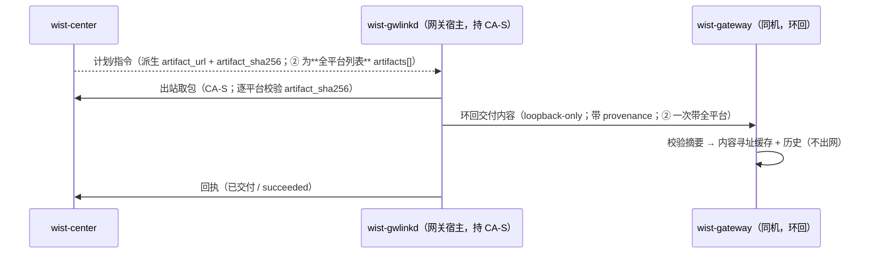

# 中心内容交付：谁取包、谁托管（分层）

> **状态**：**设计**（2026-10-09）。
> **关联**：
> [`agent-package-push-to-gateways.md`](./agent-package-push-to-gateways.md)（发布 ②：agent 包下发，本分层的第一个落地）、
> [`gateway-upgrade-and-releases.md`](./gateway-upgrade-and-releases.md)（发布 ①：中心对网关的升级）、
> [`agent-upgrade-and-packages.md`](./agent-upgrade-and-packages.md)（网关托管 agent 包：来源 → 托管 → 升级选包）、
> [`gateway-onboard-request.md`](./gateway-onboard-request.md)（同款「gwlinkd 环回」通道范式）、
> [`../foundation/cross-repo-issues.md`](../foundation/cross-repo-issues.md) **CR-003**（宿主侧常驻 `wist-gwlinkd` 是唯一面向中心者）。

## 1. 要解决的问题

中心托管的内容（制品 / 包：agent 包、网关包、知识库包、将来的策略 / 内容目录）要送到网关**落地**。
「**取包**」——把中心的镜像地址取成字节——这件事**由谁做**？

截至 2026-10-09，代码里是**网关自己在做**，且不止一处：

| 内容 | 网关侧入口 | 取包方式 |
|---|---|---|
| `wist-agentd` 安装包 | `api/admin_ops.rs::apply_agent_install_package` | 「来源地址」→ 网关拉取 |
| 知识库内容包 | `api/knowledge_ops.rs::record_knowledge_package` → `record_package(source)` | 「来源地址」→ 网关拉取 |

只要「来源」是 `https://<中心>`——而中心按常态以**私有 CA（CA-S）**签的证书起 HTTPS——**网关没有中心信任**，取包直接失败。

> **真实事故（2026-10-09）**：② Agent 包下发，网关去拉 `https://127.0.0.1:3100/api/v1/releases/artifact/...`，
> 因不信任中心私有 CA，reqwest 报 `error sending request`，环回端点回 **502**。这是本分层的直接动因。

根因不是某条端点写错，而是**「取包」的职责落在了不持有该资源信任的组件上**。

## 2. 原则：取包下沉到「持有该资源信任与网络位置」的组件

> **取包 = 出网 + 信任。谁持有对应资源的信任锚与网络位置，谁取。**
> 不让一个组件为了「顺手」去获得本不属于它的信任。

代入本系统（CR-003 已定 `wist-gwlinkd` 是**唯一面向中心者**）：

| 组件 | 信任 / 网络位置 | 取包职责 |
|---|---|---|
| `wist-center` | 内容镜像；**pull-based，够不到网关** | 不取；只表达意图 + 派生地址 / 摘要 |
| `wist-gwlinkd`（宿主侧常驻） | **唯一面向中心者**：持 CA-S / 客户端证书 / `rt_` | **对中心内容的取包** |
| `wist-gateway`（网关容器） | **agent 侧信任**（CA-G / agent mTLS）；本地控制面 | 本地**托管 + 校验 + 对 agent 分发**；取**人能填的来源**（本机 / 公网） |

依据：`gateway-upgrade-and-releases.md` §2 与 `agent-package-push-to-gateways.md` §2 已确立「中心无出站到网关、`wist-gwlinkd` 纯出站且是唯一中心对话者」。gwlinkd **本就已在取中心制品**：① 网关升级（`gops --to <url>`）、无状态工具安装（`CenterClient::artifact_http_client()`——注释原话「自签中心也能拉（制品端点本身不鉴权）」）。

## 3. 通用通道：中心内容 → gwlinkd 取 → 交付网关托管



- **gwlinkd**：`CenterClient::artifact_http_client()`（带 CA-S / 客户端证书）取字节 → 校验中心给的摘要 → 交付网关。
- **网关**：只做「内容 → 托管」（校验摘要 + 内容寻址缓存 + 历史），**不出网取中心内容**。
- **复用面**：② agent 包（本分层首个落地）、① 网关包、将来的知识库包 / 策略 / 内容目录**共用这一条**，免去「每加一种内容就重来一次『信任怎么给网关』」。

好处：① 单一中心出口，合 CR-003，收回网关的中心信任面；② 一条通道沉淀复用；③ 网关不再背中心可达性 / 信任要求。

## 4. 「来源」语义：content + provenance

网关的安装包 / 内容设置里，`来源地址` 长期被当作**取包指令**（「网关去这个地址取」）。分层之后，应重述为：

- 网关的**一等输入是内容**（本地路径 / 字节）→ 校验 → 托管 → 分发；
- **「从 URL 取」退化为面向人填来源的便捷**（本机绝对路径 / 公网 URL；与中心信任无关）；
- 中心内容记录 **provenance = 中心的 `artifact_url`**（审计留痕），但网关**不必能拉它**。

⇒ 两条入口（人填来源 / 中心交付）汇入**同一个托管内核**，而不是两份会漂移的写契约。措辞上，网关记录里 `来源` = **provenance**；「能否取到」不再是它的义务。

## 5. 交付形态（gwlinkd → 网关）

| 形态 | 做法 | 取舍 |
|---|---|---|
| **P（推荐）共享投放目录 → 本地路径** | gwlinkd 把取到的字节落到**宿主投放目录**（网关容器已只读挂载，见下）；环回仍发**既有载荷**，`package_url = /packages/<file>`（网关据此**从本地**取），另带 `origin = <中心地址>` 留痕 | 网关**同一条契约、同一个内核**（「本地绝对路径」本就是一等来源，admin 端点也支持）→ 一致性保住；复用**现有挂载**；gwlinkd 出网、网关不出网 |
| 环回塞字节（base64 / octet-stream） | 字节直接过环回 body | **不采用**：同一实体出现两条写契约 → 劈内核（违反本仓「同内核防漂移」纪律）；记录的「来源」变得对网关不可解析、语义分裂 |

现有挂载（`wist-gateway-stack/sys/docker-compose.yml`）：

```yaml
- ${PACKAGE_DIR}:/packages:ro    # 宿主 packages/ → 容器 /packages（只读）；界面「本地来源」填 /packages/<文件名>
```

`scripts/import-package.sh` 已是此约定的手工版（把包放进宿主 `packages/`，`--set` 把来源设为 `/packages/<file>`）；本分层是它的**自动版**：由 gwlinkd 在收到中心内容时自动完成「落地 + 交付」。

需补的小件：gwlinkd 两个配置（宿主**投放目录** + 容器可见**路径前缀**；dev 免容器时二者相同）、文件名约定、以及**投放目录的清理策略**（避免无界增长，见 `agent-package-push-to-gateways.md` §10）。

## 6. 边界（别过度统一）

- **standalone 网关**（无中心、无 gwlinkd）仍需网关自己取**人填来源**（本机 / 公网）。所以「网关能取包」这个能力**要保留**——只是**不用于中心内容**。
- 人写在管理面的操作（贴 GitHub URL / 本机路径）本就是网关侧，保持网关取。
- 结论：**取包能力两边都有，但「对中心的取包」只在 gwlinkd。**

## 7. 落地影响

- **②**（`agent-package-push-to-gateways.md`）：取包改 gwlinkd —— 本次落地。
- **知识库包** `record_knowledge_package`：将来同样改「gwlinkd 交付」，网关只托管（同一通道）。
- **网关记录的「来源」字段 / 管理页措辞**：语义 = provenance，与本文 §4 对齐。
