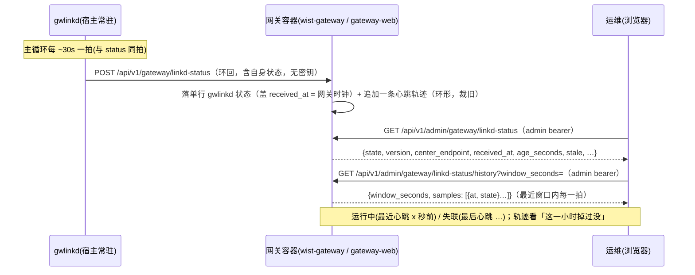

# gwlinkd 状态观测（网关 Web 展示宿主侧常驻状态）

> **状态**：**设计**（2026-10-05）。
> **关联**：[`gateway-onboard-request.md`](gateway-onboard-request.md)（同一套环回通道 / 同一「gwlinkd 纯出站」约束）、
> [`../foundation/cross-repo-issues.md`](../foundation/cross-repo-issues.md) **CR-003**（宿主侧常驻 `wist-gwlinkd`）。

## 1. 要解决的问题

`wist-gwlinkd` 是**宿主侧**常驻、与网关容器**分立**的进程。今天网关 Web 只能看到「接入」这一次性的结果
（`link_request` 的 Pending/Connecting/Connected/Failed），看不到 gwlinkd **平时活不活**：

- 它是不是在跑？（没在跑 → 页面接入永远不会被拉取，状态卡在「待拉取」而不自知）
- 它连的是哪个中心？版本多少？客户端证书什么时候到期？
- 最近的「状态上报 / 续期 / 升级取指令」有没有在正常发生？中心可达吗？

运维需要一个**持续**的观测面：**在网关 Web 上看到 gwlinkd 的存活与健康**。

## 2. 关键约束：gwlinkd 是纯出站（不可被拉）

`wist-gwlinkd` 只有主循环、**纯出站**（CR-003 R1）：它**没有**任何入站 HTTP / socket / 命令文件监听。
网关 Web（跑在容器里）与 gwlinkd（跑在宿主）之间**没有**可调用入口 —— 页面**无法直连** gwlinkd 取状态。

⇒ 观测数据**只能由 gwlinkd 主动推送**给网关。所幸这条通道**已经存在**：gwlinkd 已用环回面
（自签 HTTPS，`gateway_self_endpoint` + `gateway_self_ca`）够得到网关（self-state 读、link-request 轮询、
link-result 回报）。本设计只是**在同一形态上再加一条心跳**。

## 3. 决策：gwlinkd 周期性心跳 → 网关存储 → admin 视图 → Web 展示



- **写侧（gwlinkd → 网关）**：环回 `POST .../linkd-status`，与 link-result **同鉴权口径**（loopback-only）。
- **读侧（Web → 网关）**：admin `GET .../linkd-status`（admin bearer）。
- **gwlinkd 依旧纯出站**：这只是它出站轮询/回报的一站。
- **无密钥**：与 `link_request` 不同，gwlinkd 状态里没有 token/CA —— admin 视图可**原样**回传。

## 4. 载荷：`GwlinkdStatus`

gwlinkd 自报（snake_case；两侧各有一份**同形状的键集序列化测试**，任一侧改名即爆）：

| 字段 | 说明 |
|---|---|
| `gateway_id` | gwlinkd 绑定的中心实例名（配置里的 `gateway_id`） |
| `instance_id` | 本次运行的实例标识（`<gw>/inst-…`；重启稳定） |
| `version` | gwlinkd 版本（`CARGO_PKG_VERSION`） |
| `center_endpoint` | 当前接入的中心（未接入时为空） |
| `state` | `WaitingLinkRequest` / `Linked` / `Degraded`（见下；`Linking` 为**保留**态，当前不产出） |
| `credential_expires_at` | 客户端证书到期时刻（未持证为空） |
| `last_center_report_at` | 最近一次**成功**向中心 status 上报的时刻（未成功过为空） |
| `last_error` | 最近一次失败摘要（成功即清空；供排障） |

`state` 语义（粗粒度、面向运维，不暴露内部细节）：

| state | 含义 |
|---|---|
| `WaitingLinkRequest` | 在跑，尚未接入（无客户端证书）；等页面提交接入物 |
| `Linked` | 已接入（持客户端证书），mTLS 正常 |
| `Degraded` | 已接入但最近有失败（中心不可达 / 上报被拒 / 续期失败）——带 `last_error` |
| `Linking`（**保留**） | 语义为「正在 link-upstream / register」，但该窗口内主循环被占、**不发心跳**，故当前**不会**产出该值；前端仍按该枚举防御性映射（→「接入中」），以免将来接上后误判 |

网关侧存储在同一行上**再加**两个**网关时钟**字段（gwlinkd 自报里没有，gateway 收到时打盖）：

| 字段 | 说明 |
|---|---|
| `received_at` | 网关收到本心跳的时刻（**失联判定用网关时钟**，不受宿主/容器时钟偏移影响） |
| `reported_at` | gwlinkd 打的心跳时刻（原样存，供对齐排障） |

## 5. 新鲜度 / 失联判定

- gwlinkd 主循环拍期 = `STATUS_INTERVAL_SECS = 30s`；心跳**同拍**发送。
- 网关/admin 视图按 `received_at` 算 `age_seconds = now − received_at`，
  `stale = age_seconds > STALE_AFTER`（默认 `STALE_AFTER = 3 × 30s = 90s`）。
- 判据**只在读侧算**（不落 `stale` 布尔）：一个「服务端算的字段」会比网关时钟更早过期，
  实时算永远准。**无心跳行** = `has_status=false`（从未跑过 / 从未上报）。

## 6. 接口面（网关）

| 面 | 方法/路径 | 鉴权 | 用途 |
|---|---|---|---|
| 环回（gwlinkd） | `POST /api/v1/gateway/linkd-status` | loopback-only | gwlinkd 推自身状态（心跳） |
| admin（web） | `GET /api/v1/admin/gateway/linkd-status` | admin bearer | 页面读 gwlinkd 状态 + `age_seconds` / `stale` |
| admin（web） | `GET /api/v1/admin/gateway/linkd-status/history?window_seconds=` | admin bearer | 页面读**心跳轨迹**（缺省 1h，夹 `[60s, 2h]`） |
| admin（web） | `GET /api/v1/admin/gateway/self-state` | admin bearer | 页面读**网关（容器）自身**状态（与环回自述面同一份计算；见 §7①） |
| admin（web） | `GET /api/v1/admin/gateway/self-state/history?window_seconds=` | admin bearer | 页面读**网关自身趋势**（缺省 1h，夹 `[60s, 2h]`） |

> 后一行是 §7① 要展示「网关（容器）」时的读口：自述面（`GET /api/v1/gateway/self-state`）限环回、
> 只服务本机 gwlinkd，**浏览器够不到**，因此补一个 admin 读口（等价计算、换成 admin 鉴权）。

环回端点挂在**主监听**上，但入口按**连接源地址**校验 loopback（非环回 403，与 self-state / link-result 同口径）——不是另起一个只绑 `127.0.0.1` 的监听。
存储沿用网关既有形态：**单行设置表** `gateway_linkd_status`（`setting_id` 主键 =
`DEFAULT_GATEWAY_LINKD_STATUS_SETTING_ID`），`get` / `upsert`（无 `clear`：状态是持续量，
最后一行留着正好用来显示「失联」）。
轨迹另存 `gateway_linkd_status_history`（`at_seconds` 主键 = 网关时钟 unix 秒，`state`）：
每拍**追加**一行、写入时裁掉保留窗口（2h ≈ 240 行）外的旧行 —— 单行回答「这一拍在不在」，
轨迹回答「这一小时稳不稳」。轨迹写失败**不影响**心跳受理（当前态才是「在不在跑」的主判据）。

**网关自身**趋势另存 `gateway_self_state_history`（`at_seconds` 主键；CPU / RSS / 负载1m / Agent 在线 / 磁盘）：
网关**自己周期自采**（`spawn_self_state_sample_tick`，30s 一拍、保留 2h），与请求路径**解耦**——
不搭在页面轮询上（「有没有人看」不该决定趋势有没有数据），也不搭在 gwlinkd 的环回读上（它挂了趋势就断）。
为什么不用 center 推的 `gateway_*` 时序：那是 **center 的** VM，网关这台 VM 里没有它；
而这页要能在中心 / gwlinkd 都不在时照看本机网关。

## 7. Web 展示（`wist-gateway-web`）

gwlinkd 是**宿主侧、与网关容器分立**的常驻进程，有自己的生命周期 —— 「它活不活」与「接入成没成」
是两个问题（§8）。因此给它一个**独立观测页** `/gwlinkd`（「网关状态」，与**网关（容器）自身**状态同屏），
其余页面只留**一行摘要 + 链到该页**。

- **「网关状态」独立页 `/gwlinkd`（`SubsystemGatewayStatusPage`）**：一页看清网关两层 ——
  - **① 网关（容器）**：状态卡 + **自身趋势**（`GatewayMetricTrends`，`TrendChart`：资源占用
    （CPU / 磁盘）、内存（RSS）、Agent 在线各一张，走 `GET /api/v1/admin/gateway/self-state/history`）
    + 明细（版本 / 存储健康 / 已登记 Agent 数 / 数据面上送开关 / 最近错误，走 admin 面的自述读口）。（状态 → 趋势 → 明细）
    这正是 gwlinkd 上报中心的那份值；**页面上的 gwlinkd `version` 是 gwlinkd 自己的，两者不是一回事**。
  - **② 接入代理（gwlinkd）**：状态卡 + **心跳轨迹**（`LinkdHeartbeatTrend`：状态条每格一分钟、
    缺格 = 那分钟没心跳；心跳间隔 sparkline）+ 明细（版本 / 实例 / 中心 / 最近心跳 / 证书到期 / 最近上报中心），
    `last_error` 非空时予提示。当前拍已失联时更要看轨迹（那正是「什么时候掉的」）。
  - 两层**各占一个 tab**（同时只展开一层，免得两块长明细把页面拉成长龙；两个 panel 都挂载，
    切回去不重取数）。二者**数据来源不同**：① 在 gwlinkd 挂掉时仍可读（网关自己答），
    ② 只在 gwlinkd 活着时新鲜 —— 分 tab 但仍同屏可切。
- **「链接上级」页**：在「接入状态」卡之外加一行 **gwlinkd：运行中（最近心跳 … · v… · 中心 …）/ 失联**，
  并链到独立页 —— 「待 wist-gwlinkd 拉取」不再是无解释的死等。
- **「Gateway 信息」页**：只留**一行状态 + 链到独立页**（不在设置页重复明细）。
- 渲染规则：`has_status=false` → 「未检测到 gwlinkd」；`stale` → 「失联」；否则按 `state` 给
  「运行中 / 接入中 / 等待接入 / 降级」。
- 三处共用 `src/components/linkdStatus.ts#linkdSummary`，口径一致（失联阈值 90s 由服务端按网关时钟算）。
- 开发态：vite 代理注入 admin token 且页面启动时播种（`seedDevAdminToken`）——否则查询 `enabled=false`、整页空白（见 `vite.config.ts` 注释）。

## 8. 与 `link_request` 的关系（为何不合并）

`link_request` 是**一次性接入**事务（Pending→…→Connected，接入完成即终态、且明文券被消费清空）；
`gwlinkd status` 是**持续观测**（每 30s 刷新、永无「终态」、无密钥）。两者**寿命不同、清空时机不同**，
合并会让「接入完成」和「gwlinkd 还活着吗」两个问题互相污染。**分表、分端点**，但**共用同一环回形态与信任锚**。

## 9. 不变量与边界

1. **gwlinkd 仍无入站服务**：本条是它**出站**推送的一站（CR-003 R1 不变）。
2. **不新增到中心的通道**：状态来自 gwlinkd 自身，不经中心中转；网关**永不直连中心**。
3. **无密钥回传**：本载荷不含任何凭据；admin 视图可原样展示。
4. **失联判定用网关时钟**（`received_at`），不信任宿主自报时刻。
5. **幂等单行**：重复心跳覆盖同一行。`instance_id` 持久化在 gwlinkd 的 `state_dir`（`load_or_create_instance_id`）——**进程重启不变**；只有在**重置备 / 清空 state 目录**后才会换新，届时同表换 id 可见（供识别「重新置备了一次」）。
6. **心跳轨迹是环形记录**：每拍一行、写入时裁掉窗口（2h）外的旧行，不会无限增长；时刻用网关时钟 unix 秒、同秒重复落同一行。
7. **网关自身趋势同样自采自用**：网关周期采自己的自述面（30s 一拍、保留 2h），**不依赖 VM 与 center**；采样任务写失败只告警，不影响任何请求路径。

## 10. 备选与否决

| 备选 | 否决理由 |
|---|---|
| 页面/网关直连 gwlinkd 取状态 | gwlinkd 无入站面（明确不变量），做不到 |
| 网关问中心「我的 gwlinkd 活着吗」 | 网关不直连中心；且把「观测宿主」这件事耦合进中心 |
| 复用 `link_result` 顺带上报状态 | 那是一次性终态回报；持续心跳塞进去会让终态语义失真 |
| 只靠「接入卡在 Pending」推断 gwlinkd 不在 | 只在**未接入**时才像；已接入后 gwlinkd 挂了完全看不出来 |

## 11. 落地清单（模型 + 四个仓）

- [x] 模型 `Control.GatewayApp`：环回接口 `GwlinkdStatusInterface.ReportGwlinkdStatus`（手加、模型留档，同 self_state/link-request 口径）
      + admin entry `AdminViewGatewayLinkdStatus` + 视图 `GatewayLinkdStatusView` + binding + `AdminOperator can`
      + admin entry `AdminViewGatewaySelfState`（输出复用 `GatewaySelfState`）+ binding + `AdminOperator can`。
      （2026-10-05 留档；`jumo verify` 通过，`GwlinkdStatusInterface` 与 `LinkRequestInterface`/`SelfInterface` 同为不 bind 的环回面）
- [x] `wist-gateway`：迁移 `0025_gateway_linkd_status` + store `get/upsert` + 三个端点（环回心跳 / admin 读 linkd-status / admin 读 self-state）+ 契约/存储/端点测试。
- [x] `wist-gwlinkd`：主循环每拍 `POST .../linkd-status`（含首跑等待期的 `WaitingLinkRequest`）；环回客户端
      `report_linkd_status(...)`；序列化键集测试。
- [x] `wist-gateway-web`：新增**独立观测页** `/gwlinkd`（「网关状态」，`SubsystemGatewayStatusPage`）—— 同屏展示**网关（容器）**自身状态（走新增的 admin 自述读口）与**接入代理（gwlinkd）**状态；「链接上级」「Gateway 信息」只留一行摘要 + 链；三处共用 `linkdStatus.ts#linkdSummary`；契约 / 单元 / 源码守卫测试。✓
- [x] 三进程全真联调：gwlinkd 停/起，`GET /api/v1/admin/gateway/linkd-status` 在「运行中（age≈15s, stale=false）/ 失联（age≈105s, stale=true）」间切换（真网关 :3000 + 真 gwlinkd `GX01`，直连与经 vite 代理一致）。✓

### 落地情况（2026-10-05）

真网关（`wist-gateway` :3000）+ 真 gwlinkd（页面路，`GX01`）已跑通「**推-存-读**」：

```
# gwlinkd 每拍环回 POST /api/v1/gateway/linkd-status（无失败日志即成功）
GET /api/v1/admin/gateway/linkd-status  ->
  {"has_status":true,"gateway_id":"GX01","instance_id":"GX01/inst-…","version":"0.4.0",
   "center_endpoint":"https://127.0.0.1:3100","state":"Linked",
   "credential_expires_at":"2026-11-04T08:36:57Z","last_center_report_at":"2026-10-05T09:17:02Z",
   "last_error":"","reported_at":"2026-10-05T09:17:02Z","received_at":"2026-10-05T09:17:02Z",
   "age_seconds":8,"stale":false}
```

## 12. 开放问题

1. **心跳期**是否要与 status 同拍（30s）？更密更实时、更稀更省 —— 倾向同拍（已经是网络调用级开销）。
2. 是否要**历史/抖动**（如最近 N 次心跳的时间线）？初版只存「最新一行」；要时间线再按 self 面同形态扩。
3. `Degraded` 的**细分**（中心不可达 / 上报被拒 / 续期失败）要不要单独字段？初版塞进 `last_error` 文本。
4. 是否把「升级进行中」也并进本状态？（升级有自己的记录；初版不合，避免状态含义过载。）
