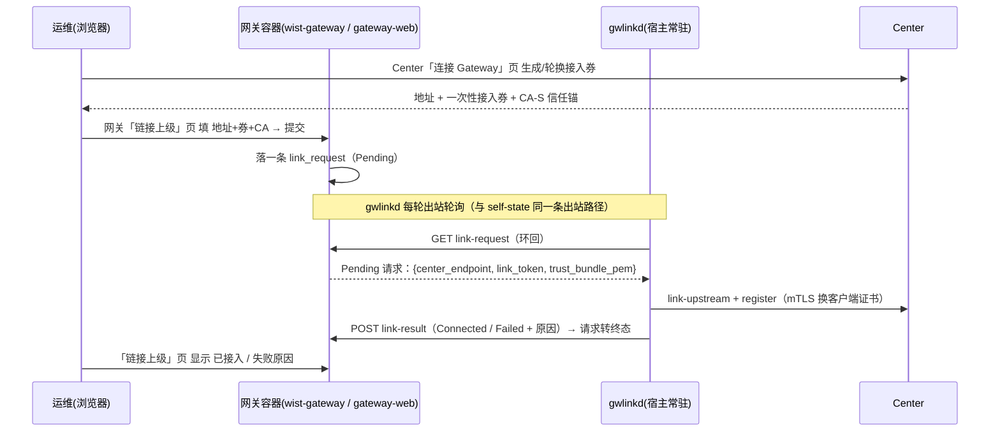

# 网关侧「接入请求」通道（页面发起接入，gwlinkd 出站拉取）

> **状态**：**设计**（2026-10-05）。落地跟踪见 §8。
> **关联**：[`../center/gateway-secure-registration.md`](../center/gateway-secure-registration.md)（两级凭据 / 接入券 / 发起方）、
> [`../foundation/cross-repo-issues.md`](../foundation/cross-repo-issues.md) **CR-003**（宿主侧常驻 `wist-gwlinkd`）。

## 1. 要解决的问题

新设计里，网关接入中心的**发起方是宿主侧常驻 `wist-gwlinkd`**（CR-003 R1：**边缘唯一与 Center 对话者**，
也是客户端证书 + 私钥的唯一持有者）。由此带来两个体验缺口：

1. **Center 页只能发券**：`wist-center-web`「连接 Gateway」页签发并一次性展示接入券，但**不能替网关完成接入**
   （私钥必须在网关本机生成）。页面只能给一条 CLI 命令。
2. **网关自带的「链接上级」页也不能用**：`wist-gateway-web` 的旧页是**浏览器直连 Center** 取初始配置 —— 那是
   「容器内自做 init」的旧模型，既不含 mTLS 注册换证，也与「发起方 = gwlinkd」相悖。

目标：**让运维在页面上完成接入，不敲 CLI**，同时**不给 gwlinkd 增加任何入站服务**。

## 2. 关键约束：gwlinkd 是纯出站（pull-only）

- `wist-gwlinkd` 只有主循环，**出站**：`self-state`（环回读网关）、`status` 上报、`renew`、`upgrade-plan` 拉取。
  它**没有**入站 HTTP / socket / 命令文件监听。
- 首跑时它**还没有客户端证书**，用不了 mTLS —— 所以它**无法**去 Center 拉「要不要接入」。

⇒ **「接入」这个命令不能来自 Center**（鸡生蛋），也**不能靠页面直连 gwlinkd**（无可调用入口）。
唯一自洽的拉源：**本机的网关容器**（gwlinkd 已经用环回够得到它）。

## 3. 决策：网关作为命令源，gwlinkd 顺路拉取

- **gwlinkd 依旧只出站**：只是把「轮询网关自述面」旁边再加一条「轮询网关待办」。
- **写侧**：页面 → 网关 **admin API**（admin bearer 鉴权）。
- **读侧**：gwlinkd → 网关 **环回控制端点**（沿用 self 面的 loopback-only 口径）。

## 4. 载荷与状态

`link_request`（网关侧存储，同一台主机内）：

| 字段 | 说明 |
|---|---|
| `gateway_id` | 本网关标识（网关侧未必自持；来自 Center 接入物 / gwlinkd 配置） |
| `center_endpoint` | 中心基地址（`https://center.example`） |
| `link_token` | 一次性接入券**明文**（gwlinkd 需用它 Bearer 鉴权；随请求一次性传递，被消费即清） |
| `trust_bundle_pem` | **CA-S 信任锚**（中心服务器证书的信任根）——**必需**，见 §5 |
| `requested_at` | 提交时刻 |
| `requested_by` | 操作人（审计） |
| `status` | `Pending` → `Connecting` → `Connected` / `Failed` |
| `result_detail` | 失败原因（供页面显示） |

## 5. 为什么 CA 是**必需**而非可选

gwlinkd 访问中心走 **HTTPS**，必须用 CA-S 校中心的服务器证书。若把 CA 当可选，就等于要求运维**先把 CA 预置到主机**
——又把「预置」偷偷塞回流程里，页面「零 CLI」不成立。因此 CA 随请求一起给；gwlinkd 拿到后把 PEM
**落成本机文件**（如 `<state_dir>/control-center.pem`），因为 gwlinkd 配置里 `trust_bundle` 是**路径**。

（Center 页已产出 `trust_bundle_pem` 内容，天然带得动。）

## 6. 接口面（网关）

| 面 | 方法/路径 | 鉴权 | 用途 |
|---|---|---|---|
| admin（web） | `POST /api/v1/admin/gateway/link-request` | admin bearer | 运维提交接入请求（地址+券+CA） |
| admin（web） | `GET /api/v1/admin/gateway/link-request` | admin bearer | 页面读状态（Pending/Connected/Failed） |
| 环回（gwlinkd） | `GET /api/v1/gateway/link-request?gateway_id=` | loopback-only | gwlinkd 拉待办（无则 204） |
| 环回（gwlinkd） | `POST /api/v1/gateway/link-result` | loopback-only | gwlinkd 回报结果（转终态） |

与 self 面一致：**环回端点只绑 `127.0.0.1`**，非环回拒绝（环回鉴权口径同 self 面，沿用「不写 `auth none`」的处理）。

## 7. 不变量与边界

1. **gwlinkd 仍无入站服务**：本条通道是其**出站**轮询的一站。
2. **vault 归 gwlinkd**：网关只是**暂存**待办；接入券明文被 gwlinkd 消费后，网关清掉（不留明文）。
3. **一次性**：接入券在 Center 侧一次性 + 短 TTL；网关上 `link_request` 消费即转终态，不重复投递。
4. **不含运行期指令**：升级 desired 仍走 Center（gwlinkd 已 `upgrade-plan` 拉取）。本通道**只承载「首跑接入」**；
   若日后要加别的网关侧指令，再按同一形态扩展（M2)。
5. **不改变 CR-003 R1**：与 Center 对话的仍是 gwlinkd；网关永不直连 Center。

## 8. 落地跟踪

- [ ] 模型：`GatewayApp.LinkRequestInterface`（环回）+ 管理面两个 entry + 结构/状态 + usecase（`jumo verify`）。
- [ ] `wist-gateway`：`link_request` 存储 + 4 个端点 + 测试。
- [ ] `wist-gwlinkd`：环回轮询待办 → `onboard`（endpoint 取自请求、CA 落盘）+ 回报 + 测试。
- [ ] `wist-gateway-web`：「链接上级」页改写（写本机网关，不再浏览器直连 Center）+ 状态显示 + 契约测试。
- [ ] 端到端联调（`gateway-tx-01` 链路）。
