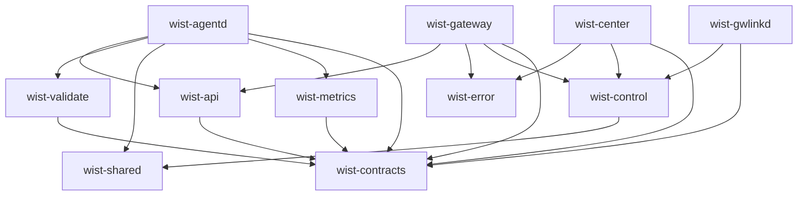

# 发布序与升级序（依赖图 / 滚动升级顺序）

## 1. 为什么单列一篇

`wist-contracts` 这类共享 crate 一改，就会牵扯多个**独立部署**的进程。实践中最容易把两件
**方向相反**的事混为一谈，本篇把它们分开钉住：

- **发布序（build / publish）**：由 Cargo 依赖图决定，**叶子先发**。解决的是「能不能编译、
  能不能发到 crates.io」。
- **升级序（rollout）**：由线上协议兼容决定，**接收端先升、自顶向下**。解决的是「新旧版本
  能不能在同一时间共存」。

一句话：**发布序自底向上，升级序自顶向下。**

## 2. 依赖图（谁依赖谁）

箭头 = 「依赖」（`A → B` 读作 A 依赖 B）。叶子：`wist-contracts` / `wist-shared` / `wist-error`。

要点：

- **三个服务（agentd / gateway / center）彼此不直接依赖**；它们共享底座、但不成链。
- **共同底座只有 `wist-contracts`**（agentd / gateway / center / gwlinkd 全依赖）。
- `agentd` 另有私有底座 `wist-validate` / `wist-metrics`（二者都只依赖 `wist-contracts`）。
- `gateway` / `center` 另有共同底座 `wist-control` + `wist-error`（agentd 不碰）。
- `wist-api` 是**跨进程 seam 报文**的 crate（目前 `agent/enroll`）：`agentd` 与 `gateway` 共依赖，只依赖
  `wist-contracts`。它**不挂 `wist-control`**——否则 agentd 会反向依赖整个 Control 域。
- 前端 `wist-center-web` / `wist-gateway-web` 不在本图内（见 §7）。

## 3. 发布序（叶子先）

规则：**被依赖者先发到 crates.io**，消费方才可能编译通过。

- `wist-contracts` → { `wist-validate`, `wist-metrics` } → `wist-agentd`
- `wist-contracts` → `wist-api` → { `wist-gateway`, `wist-agentd` }
- `wist-contracts` → { `wist-gateway`, `wist-center`, `wist-gwlinkd` }
- `wist-shared` → `wist-control` → { `wist-gateway`, `wist-center`, `wist-gwlinkd` }
- `wist-error` → { `wist-gateway`, `wist-center` }
- `wist-validate` / `wist-metrics` → `wist-agentd`

| 升这个（叶子在前） | 必须连带发布的消费方 |
|---|---|
| `wist-contracts` | validate、metrics、agentd、gateway、center、gwlinkd |
| `wist-shared` | control、gateway、center、gwlinkd、agentd |
| `wist-error` | gateway、center |
| `wist-control` | gateway、center、gwlinkd |
| `wist-api` | gateway、agentd（seam 迁 center/gwlinkd 后再加） |
| `wist-validate` / `wist-metrics` | agentd |

> 多 crate 联调期：用本地 `path` 把**整条链一起切**（否则图上会同时出现同名 crate 的两个版本、
> 跨边界类型对不上）；发布时按上表顺序切回 registry。

## 4. 升级序（接收端先、自顶向下）

数据流方向是 `agentd → gateway → center`（逐级向上）。而契约普遍带
`#[serde(deny_unknown_fields)]`（`gateway.rs` 14 处 / `agent_config.rs` 14 处 / `work.rs` 12 处 /
`enrollment.rs` 11 处 …）——**旧端遇到新字段会直接拒收**（`unknown field`）。

因此新字段必须**先被接收端认识**，顺序只能是：

1. **`center` 先升** —— 认识新的上报。
2. **`gateway` 再升** —— 认识新的 agent 上报，同时向上发新上报。
3. **`agentd` 最后升** —— 发新字段。

实测依据：`wist-gateway-stack` CHANGELOG（`0.1.24-alpha`）——

> 先布新网关、再布新 agentd：状态上报契约新增了字段，**旧网关会拒收带新字段的上报**。
> 顺序：`gops sys download`（拉新镜像）→ `gops sys start` → 再把 agent 升到 `v0.1.24-alpha`。

**gwlinkd 的位置**：它处在 `gateway ↔ center` 这一跳之间（注册/凭据 `gateway_control`、状态
上报）。涉及这一跳的契约变更时同样**`center` 先、`gwlinkd` 后**。

## 5. 混版窗口

升级期间必然出现**新 `center` + 旧 `gateway` + 旧 `agentd`** 并存：

- 低版本不得依赖只有高版本才有的语义（**向下兼容**是硬要求）。
- 每升一级，先验证**上一级在本级升级后仍工作**，再进下一级；不能一把梭。

## 6. 判据：这次改动走哪个序？

- 只改 **agent → gateway** 一跳（如纯增字段）→ 实际顺序 **`gateway → agentd`**（center 不受影响）。
- 改到 **gateway → center 上报面** / 跨多跳 / `gateway_control` → 最稳顺序
  **`center → gateway → agentd`**（涉及注册凭据时 `center → gwlinkd`）。
- 纯**内部重构、不改线上 JSON**（只改依赖 pin、加私有函数等）→ 无升级序约束，按发布序即可。

## 7. 前端

`wist-center-web` / `wist-gateway-web` 不在 Rust 依赖图内，靠 HTTP API 对接：只要求**后端先行**
（新增字段对前端是宽容的，旧前端忽略未知键即可），没有 `deny_unknown_fields` 那类硬约束。

## 8. 与实操的对应（示例）

- **升 `wist-contracts` 0.1 → 0.2**：发布序 = `contracts(0.2.0) → validate(0.1.4) + metrics(0.1.5)
  → agentd(0.1.26)`；`gateway` / `center` 直接改 pin（已在 0.2）。上线时按 §4 **自顶向下**。
- **升 `wist-control` 0.6.0 → 0.6.1**：发布序 = `control → {gwlinkd, center, gateway}`；上线同样
  `center → gateway/gwlinkd`。

## 9. 相关

- [architecture.md](./architecture.md) §9 协议与通信面
- [api-seam-inventory.md](./api-seam-inventory.md) API seam 清单与缺口（seam = 运行时耦合点）
- [cross-repo-issues.md](./cross-repo-issues.md) 跨仓问题
- 各仓 `_gal`（`gx adm` 版本/标签流程）与根 `CHANGELOG.md`
